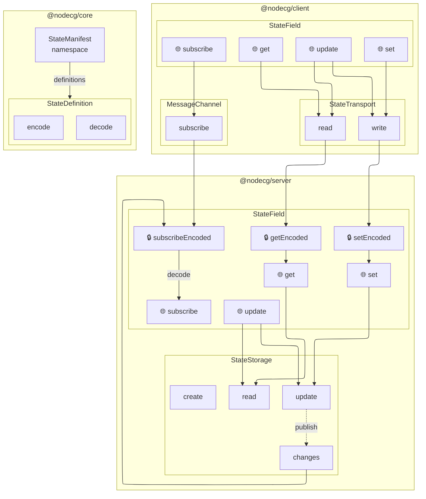

# NodeCG

Experimental new version of NodeCG in active development from scratch

## API

### Philosophy

- Modular and extensible
- Decoupled client-side that supports both browsers and servers
- Simple and intuitive APIs without pitfalls
- Immutable data structures and updates
- TypeScript first and complete type safety

### Draft

```ts
const roles = defineRoles({
  judge: {
    description: "Judge standing next to the players",
    permission: ["all"], // Or "state-read" | "state-write" | "computed-read" | "topic-subscribe" | "topic-publish"
  },
  monitor: {
    permission: ["state-read", "computed-read", "topic-subscribe"],
  },
  viewer: {
    permission: ["state-read", "computed-read"],
  },

  // Reserved role for all users by default
  everyone: {
    permission: ["state-read", "computed-read"],
  },
}); // Automatically adds "everyone" which means all users, no permissions

const match = defineNamespace("match", {
  state: {
    score: {
      schema: Schema.Struct({ left: Schema.Number, right: Schema.Number }),
      permission: {
        read: {
          deny: [roles.viewer],
        },
      },
    },
    label: {
      schema: Schema.NonEmptyTrimmedString,
      permission: {
        write: {
          allow: [roles.monitor],
        },
      },
    },
  },

  computed: {
    winning: {
      schema: Schema.OptionFromNullOr(Schema.Literal("left", "right")),
      permission: {
        read: {
          deny: [roles.judge],
        },
      },
    },
  },

  // Not yet
  data: {
    upcoming: {
      schema: Schema.Array(Schema.Struct({ id: Schema.UUID /* ... */ })),
    },
  },
  topic: {
    start: {
      schema: Schema.Boolean,
      permission: {
        subscribe: {
          deny: [roles.viewer],
        },
      },
    },
  },
});

// Server-side
const match = loadNamespace(match, {
  seedState: {
    score: () => ({ left: 0, right: 0 }),
    label: () => "Match 1",
  },
  implementComputed: {
    winning: (state) => {
      const leftAdvantage = state.score.left - state.score.right;
      return leftAdvantage > 0 ? "left" : leftAdvantage < 0 ? "right" : null;
    },
  },
});

match.state.label.get() === "Match 123";

// Client-side
const match = loadNamespace(match);

match.state.label.subscribe((label) => {
  dom.innerText = label;
});
```

### Shared State

- ✅ State is declarative: it is defined in a single place with name and schema

  ```ts
  const manifest = defineState("match", {
    counter: { schema },
    games: { schema },
  });
  ```

- ✅ State is platform agnostic: it can be loaded with dedicated server or client API

  ```ts
  // Server-side
  import { loadState } from "@nodecg/server";

  const state = await loadState({
    manifest,
    initialValues: { counter: () => 0, games: () => [] },
  });
  console.log(state.counter.get()); // synchronous on the server

  // Client-side
  import { loadState } from "@nodecg/client";

  const state = await loadState({ manifest });
  console.log(await state.counter.get()); // asynchronous over the network
  ```

- ✅ State is immutable: it provides read-only value, and can be set or updated by returning a new value from the updater (which may be async)

  ```ts
  console.log(await state.counter.get()); // Returns read-only value

  await state.counter.set({ count: n, timestamp: Date.now() });

  await state.counter.update((value) => {
    value.timestamp = Date.now();
    return value;
  });
  ```

- ✅ State is reactive: it provides subscription API to listen to changes

  ```ts
  const unsubscribe = await state.counter.subscribe((newValue) => {
    console.log("Counter updated:", newValue);
  });

  // later, when you want to stop listening
  unsubscribe();
  ```

- 🚧 State supports transactions: multiple updates can be batched together to ensure consistency

  ```ts
  await state.transaction(() => {
    state.counter.update((value) => {
      value.timestamp = Date.now();
      return value;
    });
    state.games.update((value) => [...value, "New Game"]);
  });
  ```

- 🚧 State supports migrations: when schema changes, state can be migrated to new schema without data loss

  ```ts
  const newManifest = defineState("match", {
    counter: { schema },
    games: {
      schema,
      migration: [
        {
          oldSchema,
          migrate: (oldValue) => {
            return oldValue.map((game) => {
              // ...
            });
          },
        },
      ],
    },
  });
  ```

- 🚧 State supports access control: permissions can be defined for each state to control who can read or update it

  ```ts
  const manifest = defineState(
    "match",
    {
      counter: {
        schema,
        permissions: {
          read: ["judge", "producer"],
        },
      },
      games: {
        permissions: {
          update: [], // Only system can update
        },
      },
    },
    {
      permissions: {
        read: ["viewer"],
        update: ["admin"],
      },
    },
  );
  ```

- ✅ State supports computed values derived from other state on the server. The manifest declares the schema; the compute function is provided on the server.

  ```ts
  // Manifest: declare schema only
  const manifest = defineState(
    "match",
    {
      counter: { schema },
      games: { schema },
    },
    {
      computed: {
        firstGameId: { schema },
      },
    },
  );

  // Server: provide the compute function
  const state = await loadState({
    manifest,
    initialValues: { counter: () => 0, games: () => [] },
    computed: {
      firstGameId: (sources) => sources.games[0]?.id ?? null,
    },
  });

  // Client: read-only
  const state = await loadState({ manifest });
  await state.firstGameId.subscribe((firstGameId) => {
    console.log("First game updated:", firstGameId);
  });
  ```

- ✅ State supports namespaces: states can be grouped into namespaces to avoid name conflicts and manage permissions more easily

  ```ts
  const commercialManifest = defineState(
    "commercial",
    {
      isRunning: { schema },
      remainingTime: { schema },
    },
    {
      permissions: {
        read: ["producer"],
        update: ["producer"],
      },
    },
  );
  ```

- 🚧 Admin dashboard (view, clear, export, import, freeze)
- 🚧 boolean option for persistence
- 🚧 Hooks: `beforeUpdate`, `afterUpdate`
- 🚧 State in client-side is synchronized on reconnect
- 🚧 Revision number
- 🚧 Conflict resolution with custom logic
- 🚧 Encryption at rest
- 🚧 Subscription update frequency control
- 🚧 State update audit log (user, timestamp, label)
- 🚧 List of subscribers with user, session, connection
- 🚧 Built-in stopwatch/timer logic, scheduled updates
- 🚧 Soft-delete removed state definitions
- 🚧 External webhook registration for state updates

- 🚧 Cross instance state sharing

#### State Schema

- ✅ Effect Schema
- 🚧 JSON Schema
- 🚧 Zod
- 🚧 Valibot

#### What happens when multiple updates happen at the same time?

#### What happens when only client defines state?

### 🚧 Messaging

- Messages go through a Channel. Channels are defined with name and schema.
  ```ts
  const chatChannel = defineChannel("chat", schema);
  ```
- Messages can be sent to a channel.
  ```ts
  await chatChannel.send({ text: "Hello, world!" });
  ```
- Messages can be listened to with a callback.
  ```ts
  const unsubscribe = chatChannel.subscribe((message) => {
    console.log("Received message:", message);
  });
  ```

### 🚧 Data

For datasets too large to keep in memory. Unlike State, which is mirrored in memory and read synchronously, Data is read and written asynchronously, straight from the store, and never kept in-memory permanently.

### Data Persistence

- ✅ Data persistence is abstracted and can be implemented for any storage backend
- 🚧 Default data persistence is SQLite for system data, and JSON files for State

### 🚧 Authentication

### 🚧 Authorization

### 🚧 Asset storage

### 🚧 Outdated Client Detection

## Development

- Install: `pnpm install`
- Type check: `pnpm type-check`
- Test: `pnpm test`
- Lint: `pnpm lint`
- Format: `pnpm fmt`
- Start dev server: `pnpm dev`

### Architecture

NodeCG is a full-stack framework where there are server-side code, client-side code, and small runtime code and types used in both environment. In order to have clear separation, this repository uses monorepo with pnpm.

- Server-side package: vitest runs on Node.js environment. Can use APIs from `node:*` imports. Cannot use browser APIs (window, document, etc)
- Client-side package: vitest runs browser mode and runs tests in real browsers. Can use browser APIs, but cannot use `node:*` imports.
- Package for both: vitest runs both on Node.js environment and browser mode. Cannot import `node:*` and cannot use browser APIs.

The codebase uses Effect for type-safety, error-safety, and dependency injection.

- Entire codebase runs as Effect, except user-facing functions that provides both Effect-based interface and non-Effect interface. The boundary is at the very edge to keep the advantages of Effect.

#### Data flow



## License

MIT License
